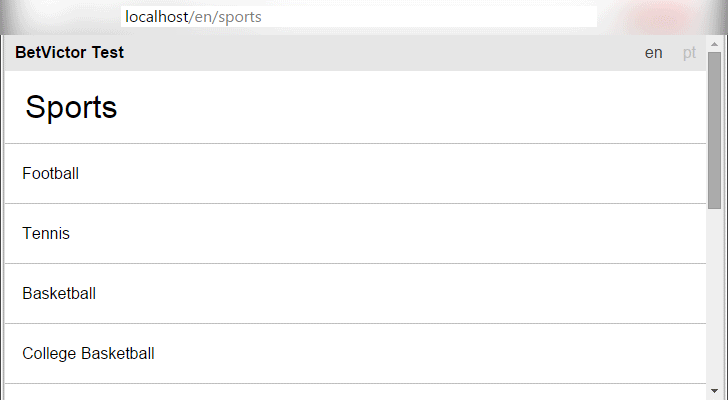
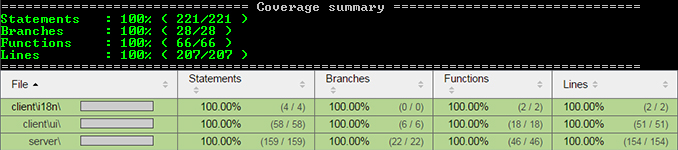
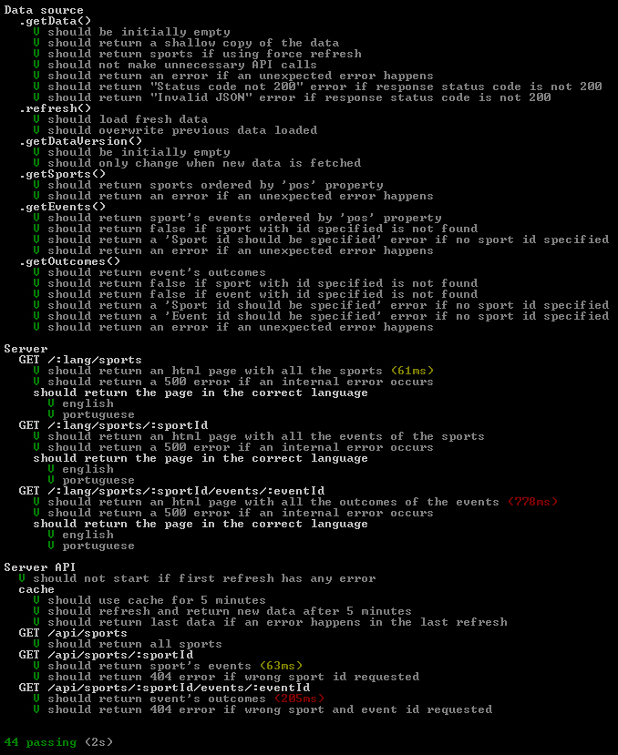

# BetVictor test

This is a test project for Bet Victor.

**Final result:**

  

*The app is rendered on the server side with react components, no client side JavaScript is run.*

**Jump to:**

 - [Install](#install);
 - [All commands](#all-commands);
 - [API](#api-1);

## Objectives

Create a Node.js application that calls the following URL and navigates through its content.

URL: http://www.betvictor.com/live/en/live/list.json

The Content hierarchy is: Sports > Events > Outcomes

**Minimum requisites are:**

 - Method to list all sports (`/sports`);
 - Method to list all events for a given sport (`/sports/<id>`);
 - Method to list all outcomes for a given event (`/sports/<id>/events/<id>`);
 - Full test coverage (Mocha is a good test framework);

**Notes:**

 - Obey the list order as per upstream API 'pos' property
 - Please use a local Git repository and commit as you go along

**Extra points for:**

 - Language support;
 - Caching;

## Results

All the requisites have been completed backed with [automatic tests](#tests) with [100% test coverage](#test-coverage).

I've decided to create 2 endpoints instead of only one:

 - [Rendered html](#server-side-rendering);
 - [JSON API](#api): to be used by the client side app (not included in this project);

The sports and events are ordered by the 'pos' property.

Currently the app supports [2 languages](#multilanguage) and uses [5 minutes cache](#data-source-and-caching).

### Architecture

**The application has 3 main parts:**

 - Data source;
 - API;
 - Server side rendering;

Note: the app uses promises to handle asynchronous flows.

### Data source and caching

The data source's responsibility is to load data from the endpoint `http://www.betvictor.com/live/en/live/list.json` and then return when requested.
In order to increase performance all data is cached for 5 minutes.
View its [api](https://rawgit.com/hackhat/betvictor-test/v0.0.2/docs/jsduck/index.html#!/api/server.DataSource), [source code](./src/server/DataSource.js)
and [tests](./test/DataSource.js).

### API

The server returns data as JSON on these endpoints:

 - `localhost/api/sports`: all sports as JSON;
 - `localhost/api/sports/<sportId>/events`: all events of the `<sportId>` specified as JSON;
 - `localhost/api/sports/<sportId>/events/<eventId>`: all outcomes of the `<sportId>` and `<eventId>` specified as JSON;

All the API endpoints are covered by [tests](./test/serverApi.js). See the [source code](./src/server/boot.js).

### Server side rendering

The server outputs html rendered with [react](http://facebook.github.io/react/) on several endpoints:

 - `localhost/<lang>/sports`: all sports in `<lang>` specified;
 - `localhost/<lang>/sports/<sportId>`: all events in `<lang>` and `<sportId>` specified;
 - `localhost/<lang>/sports/<sportId>/events/<eventId>`: all outcomes in `<lang>`, `<sportId>` and `<eventId>` specified;

All the html endpoints are covered by [tests](./test/server.js). See the [source code](./src/server/boot.js).

### Multilanguage

Currently the server only has only 2 languages: [Portuguese](./src/client/i18n/pt_PT.js) and [English](./src/client/i18n/en_US.js).
Switching language will keep the same position in the app hierarchy, instead of redirecting to the root (better UX).

To note that only the application part is translated (like titles and some other items). No data has been translated.

### Build process

The build process is based on [gulp](http://gulpjs.com/) and
[webpack](http://webpack.github.io/). Currently the server doesn't rebuild the
CSS part (this could be improved with some work).

### Tools

 - Issue tracker: [Asana](https://asana.com).
 - Coded with [Sublime Text 2](http://www.sublimetext.com/2).

## Conclusions

The project is not perfect but does what is supposed to do.

**Some improvements that could be done:**

 - Translate data: for example the text "First half" could be translated too;
 - Make routes isomorphic: by doing this you reuse the same code between client and server;
   - Search engines gets the html with populated data;
   - End users get only the JSON data after the first request (the first request get an html page with populated data);
 - Automate the CSS rendering: this has to be done with gulp to keep it in memory instead of writing to file;
 - The routing system could be better:
  - Routes on the client side should be generated and not manually written;
  - Server side could use route contexts;
 - Errors that happen on the server should be logged with something like
   [node-bunyan](https://github.com/trentm/node-bunyan) instead of being returned to the client.
 - The rendering part of the app could reuse the API endpoints instead of using the DataSource.

**What went bad:**

 - I've tried to use a new way to render the CSS (with my [smart-css](https://github.com/hackhat/smart-css) tool)
   but it would took even more time to implement. A new gulp task would be required to load the app and write
   the CSS to a file.
 - Being a long user of my own library, which abstracts express, [easy-express](https://www.npmjs.com/package/easy-express)
   I had to touch express directly to keep the code simpler and to limit new concepts;

## Install

 - Clone project;
 - Open a console and cd into the root of the project;
 - Run the command `npm install`;

## All commands

All commands should be run from the root of the app:

 - Build css and html: `gulp build` (needed after changing styles or html files);
 - Run a local server: `gulp server` (then go to [http://localhost/en/sports](http://localhost/en/sports));
 - Run tests:
   - With code coverage: `istanbul cover --root ./src --hook-run-in-context node_modules/mocha/bin/_mocha -- -R spec`
     (remember to first install istanbul: `npm install istanbul -g`. Code coverage report is located in `./coverage/lcov-report/index.html`)
   - Without code coverage: `mocha`;
 - Build docs and API: `jsduck`;

## Start server

To start the server in development mode you just run: `gulp server`;

On every change in the `src` folder, the server will restart.
Note that you need to rebuild the CSS in order to take effect by running this script `gulp build`.
The development tools can be improved to auto refresh the CSS files.

Now go to [http://localhost/en/sports](http://localhost/en/sports) to view the app working;

## Run tests

If you need to run with code coverage first install istanbul globally with the command: `npm install istanbul -g`.

To run tests you have to open a console and cd into the root of the project. Then chose the type of test to run:

 - With code coverage: `istanbul cover --root ./src --hook-run-in-context node_modules/mocha/bin/_mocha -- -R spec`
 - Without code coverage: `mocha`;

If you ran the test with code coverage open this file to check the html report: `./coverage/lcov-report/index.html`

## API

The API of the project is located **[here](https://rawgit.com/hackhat/betvictor-test/v0.0.2/docs/jsduck/index.html)**.
Has been automatically generated with [jsduck](https://github.com/senchalabs/jsduck).

## Test coverage

The current application is 100% covered. Even being 100% covered doesn't mean all edge cases have been covered, I'm aware that
some rare edge cases have not been handled. Handling them would take a lot of time and I think is out of the context of this project.

View test coverage report [here](https://rawgit.com/hackhat/betvictor-test/v0.0.2/coverage/lcov-report/index.html).

Code coverage done with [istanbul](https://github.com/gotwarlost/istanbul).

## Tests

  

All the tests has been written with [mocha](https://github.com/mochajs/mocha), [supertest](https://github.com/visionmedia/supertest),
[cheerio](https://github.com/cheeriojs/cheerio), [chai/expect](http://chaijs.com/) and [sinom](http://sinonjs.org/) and takes 2 seconds to run them.

Fixtures are stored into the [/test/data](/test/data). There are 2 files which contains 2 different days' data.
Are required to test whenever it loads fresh data every 5 minutes.

**Used:**

 - Fake timers: for testing the cache of the DataSource;
 - Async stubs;
 - Fixtures;
 - Cheerio: for testing the html output of the app;

## Code style

### Requires

My require style is like this:

    var a = require('a');
    var b = require('b');

instead of:

    var a = require('a'),
        b = require('b');

because is easier to manipulate them. You can copy-paste and sort lines without further changes.
In the first example I can easily switch the lines with "ctrl+shift+UP" and go with it.
In the second example you have to change the "var" keyword, comma and spacing.
