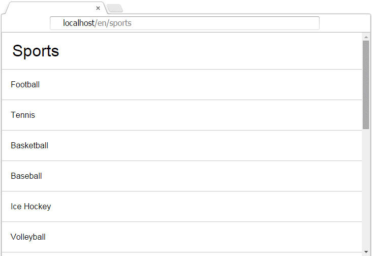

# BetVictor test

This is a test project for Bet Victor.

Final result:

  

## Objectives

Create a Node.js application that calls the following URL and navigates through it's content.

URL: http://www.betvictor.com/live/en/live/list.json

The Content hierarchy is: Sports > Events > Outcomes

Minimum requisites are:

 - Method to list all sports (/sports)
 - Method to list all events for a given sport (/sports/<id>)
 - Method to list all outcomes for a given event (/sports/<id>/events/<id>)
 - Full test coverage (Mocha is a good test framework)

Notes:

 - Obey the list order as per upstream API 'pos' property
 - Please use a local Git repository and commit as you go along

Extra points for: Language support, Caching;

## Results

All the requisites has been completed and backed with automatic tests.

### Architecture

The application is divided in 3 main parts:

 - Data source;
 - API;
 - Server side rendering;

Uses promises to handle asynchronous flows.

### Data source and caching

The data source's responsibility is to load data from the endpoint `http://www.betvictor.com/live/en/live/list.json` and then return when requested. In order to increase performance all data is cached for 5 minutes. View it's [api](https://rawgit.com/hackhat/betvictor-test/v0.0.2/docs/jsduck/index.html#!/api/DataSource) or [source code](./src/server/DataSource.js).

### API

The server returns data as json on these endpoints:

 - localhost/api/sports: all sports as json;
 - localhost/api/sports/<sportId>/events: all events of the <sportId> specified;
 - localhost/api/sports/<sportId>/events/<eventId>: all outcomes of the <sportId> and <eventId> specified;

All the API endpoints are covered by tests.

### Server side rendering

The server outputs html rendered with react js on several endpoints:

 - localhost/<lang>/sports: all sports in <lang> specified;
 - localhost/<lang>/sports/<sportId>: all events in <lang> and <sportId> specified;
 - localhost/<lang>/sports/<sportId>/events/<eventId>: all outcomes in <lang>, <sportId> and <eventId> specified;

All the html endpoints are covered by tests.

### Multilanguage

Currently the server only has only 2 languages: [portuguese](./src/client/pt_PT.js) and [english](./src/client/en_US.js).

To note that only the application part is translated (like titles and some other items). No data has been translated.

### Build process

The build process is based on [gulp](http://gulpjs.com/) and [webpack](http://webpack.github.io/). Currently the server doesn't rebuild the CSS part, therefore this could be improved.

### Tools

Issue tracker: [asana](https://asana.com).
Coded with [sublime text 2](http://www.sublimetext.com/2).

## Conclusions

A lot more things could be done like translate every data from the source, make it isomorphic and automate some tasks. I've tried to use a new way to render the CSS (with my smart-css tool) but it would took even more time to implement.

## Install

 - Clone project;
 - Open a console into the root of the project;
 - Run the command `npm install`;

## Start server

To start the server in development mode you just run:

    `gulp server`

On every change in the `src` folder, the server will restart. Note that you need to rebuild the css in order to take effect by running this script `gulp build`. This is a part that can be improved (normally the server side returns an empty html, but in this case everything is server side rendered, therefore an extra process would be required to automatically recompile css files).

Now go to: (localhost/en/sports)[localhost/en/sports];

## Run tests

To run tests you have to open a console and cd into the root of the project. Then chose the type of test to run:

 - With code coverage: `istanbul cover --root ./src --hook-run-in-context node_modules/mocha/bin/_mocha -- -R spec`
 - Without code coverage: `mocha`;

If you ran the test with code coverage open this file to check the html report: `./coverage/lcov-report/index.html`

## API

The API can be found by opening the file **[full API here](https://rawgit.com/hackhat/betvictor-test/v0.0.2/docs/jsduck/index.html)** and has been automatically generated with [jsduck](https://github.com/senchalabs/jsduck).

## Test coverage

  

The current application is 100% covered. View report here **[full API here](https://rawgit.com/hackhat/betvictor-test/v0.0.2/coverage/lcov-report/index.html)**

This report has been created with [istanbul](https://github.com/gotwarlost/istanbul).

## Test

  

All the tests has been written with [mocha](https://github.com/mochajs/mocha) and [sinom](http://sinonjs.org/) and takes 2 seconds to run on my machine.

Used:

 - Fake timers: for testing the cache of the DataSource;
 - Async stubs;
 - Fixtures;

## Code style

### Requires

My require style is like this:

    var a = require('a');
    var b = require('b');

instead of:

    var a = require('a'),
        b = require('b');

because is easier to manipulate them. You can copy-paste and sort lines without further changes. In the first example I can easily switch the lines with "ctrl+shift+UP" and go with it. In the second example you have to change the "var" keyword, comma and spacing.

### Spacing

Spacing used in this project is like this:

    var a = function(p1, p2){
        return p1 + p2;
    }

instead of this:

    var a = function (p1, p2) {
      return p1 + p2;
    }

because I'm more used to. I keep all my code style standard across the code I write.
